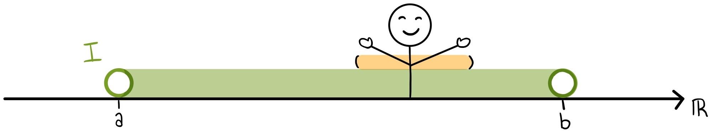

# Core Concepts and Definitions

## Interior Points and the Interior of a Set
What does it mean for a point to be an interior point of a set?

This is going to be an important idea because it is going to allow us to speak about which points inisde of a set hava a little bit
of breathing room around them and which do not. It is those points with a little bit of breathing room that we can interior points,
and these are goin tobe fundamental to our definition of what gets to be an open set. 

Our story begins with a subset $A$ of the real numbers $\real$. as well as a point $x$ inside of that subset.

We can write this mathematically by saying:

Let $A \subseteq \real$ be a real subset, and $x \in A$.

And now we want to ask ourselves if the point $x$ has a little bit of wiggle room
around it without leaving the set. Any points that have this wigge room are called an
**"interior point"**.

Imagine you are standing on the real number line at the point $x$. Can you reach out
your arms, even just a little bit, and not touch any elements outside of $A$? This 
question probably depends on how long your arms are! If you reach out too far, eventually you are going to touch something outside of your set, so you might need to
make your arms really really short to make this happen, but as long as there is some
small positive length of your arms that stays within your set, you are an interior point.

The fundamental notion that goes into this defintion is an 
**"$\epsilon$-Neighborhood"** or "$\epsilon$-Ball"- a ball of radius $\epsilon$ 
around the point $x$. In our example, $\epsilon$ would be the length of one of your
arms (by convention our arms will always be the same length, so that we are
reaching equal distances on both sides), and since it is a length $\epsilon$ can
never be negative.

The $\epsilon$ neighborhood is the set (that we are going to call $B_\epsilon(x)$)
that consists of all the real numbers which are at a distance of less than 
$\epsilon$ away from us at $x$. So that would be the open interval from $x-\epsilon$
to $x+\epsilon$

We can formally define the $\epsilon$-neighborhood at $x$ as the set $B_\epsilon(x) = (x-\epsilon, x+\epsilon)=\{t \in \real: |x-t| < \epsilon\}$.

We want to call $x$ an interior point of $A$ if its true that if my arms are short enough, I can reach out to both sides of myself and not touch anything that's outside of $A$.

To make this mathmatical we can say that the $\epsilon$ neightborhood at $x$
(everything you can touch) is a subset of A, or:

**$x$ is an interior point if $B_\epsilon(x) \subseteq A$**

This definition just says that I am an interior point if I have an $\epsilon$-ball, even if it is a really really small one, as long as it has a positive radius, centered at me which is entirely within the set A.

All we need is one example, we don't need this to be true for a bunch of differnet
arm lengths or radii- we just need a single positive value of $\epsilon$ where this
is true to be able to call our point an interior point.

All of the interior points of a set are called the interior of the set, i.e. the 
**interior of $A$** (int($A$) of $A^{\mathrm{o}}$) is the set of all interior
points of $A$.

Now lets take an example:

What is the interior of $A = [-2,4)\cap\{6\}$?

Our set A is the interval from -2 to 4, includsive of -2 unioned together with the 
singleton point at 6.

First, lets sketch it out:

-2 is a solid circle since we are including -2, 4 will be an open circle since we are
not including 4 and another solid circle at 6.

Now lets figure out what points are interiour points of $A$ by imagning standing at various points in this set and then ask the question can I reach out my arms without leaving the set, even if my arms have to really really tiny.

Where can I stand and stretch my arms?

The first place to test, is right smack in the middle, anywhere between -2 and 4 but not at one of those end points. Is it possible for me to stand and stretch out my arms as 1, or $-\sqrt2$ or $\pi$? Any of those numbers are between -2 and 4. Yes, I cans stretch out my arms even if it has to be a very small amount, even if I'm standing at 3.999 there is some small little radius I can stretch out and my
$\epsilon$-neighborhood be entirely contained within A.

So if x is any point between -2 and 4, exxclusuve of the endpoints, then $x$ is going
to be one of the interior points of $A$. 

But that does not cover the endpoints.

Can I stand at number 4 and stretch out my arms? Well the problem here is that there
is nowhere for me to stand. Because our set $A$ does not include the point 4, 4 could
never be an interior point. This is a fundamental rule of interior points, **to be an
interior point of $A$, the point has to first be an element of that set**. So 4 is 
NOT and interior point.

What about 6?

I can stand at 6 because it is an element of A, but can I stretch out my arms
without leaving the set? The answer this time in no. No matter how short my arms are
as soon as I reach out to either side (i.e to 5.99 or 6.01), I am outside of A. So
even though 6 is an element of $A$ is does not get to be an interior point.

As you might imagine, the same is true about -2. When I stand at -2 and reach out my arms to both sides, ther is one direction that I can reach, but if I reach to the left (i.e. to the more negative side of the number line),  there are no more elements
of $A$ for me to touch, no matter how short my arm is. SO -2 also does not get to be
an interior point of $A$. This is an example of a key part of the definition of an
interior point, the $\epsilon$-neighborhood must go on both sides of the point and
be centered at the point.

So taking stock, the interior of $A$ is going to consist of only the real numbers between -2 and 4 but its not going to include -2 because of the arm that reaches outside of $A$ and it's not going to icnlude 4 because 4 wasn't in the set in the first place and it's not going to include 6 because no matter how short my arms are at 6 I can't reach out without touching something that's outside of the set. So the interior should consist just of the open interval -2 to 4, or:

$\textrm{int}(A) = (-2, 4)$

## Open Sets
There's an old saying, that no matter how far you run towards the horizon between the earth and the sky you are 
never going to reach it. The real number line is kind of like that too, no matter 
how far on the real number line that we run out towards the left or the right we're
never going to fall off the end of number line because there are always more real
numbers. 

This makes the real number line a really nice set to work with- if we have a function
on the real number line we can never fall off the function's graph.

Our goal in this section is to find other sets that also have that property, they don't
really have an edge.

Now that we know what an interior point is, we can say that an **open set is a set
whose points are all interior points**.

More mathematically, a subset $A \subseteq \real$ is an open set is every point $x \in A$ is an interior point of $A$.

We can spell this out explicitly with the definition of an interior point: 

A is an open set if for ALL $x \in A$ there exists $\epsilon > 0$ such that $B_\epsilon(x) \subseteq A$.

We've previouslty defined the interior of a set- the set of all of its interior points. Because an open set has interior points for all of its points, for an open set $\textrm{int}(A) = A$.

The most obvious example of an open set may be a finite open interval, an open interval from point A to point B, exclusive of those points.

You can stand on any point $x$ within $I$ and you will always be able to reach out your arms, even if it is just a small amount. Even as you approach very close to either endpoint $a$ or $b$, because they are not included you will always be able to get that wiggle room.

## Isolated Points and Discrete Sets
While interior points have wiggle room, there are other points that do not. What if no one in my neighborhood is part of my set except for myself?

We call these points isolated points. If you stand on an isolated point, you cannot reach your arms, everything you touch is not a part of your set.

Sets that are made up entirely of isolated points are called discrete sets.

Suppose that I have a subset of the real line, $A$, that looks like this:

I want to know what it would look like to be a point that stand alone from the set in my $\epsilon$-neighborhood.

First off, I know what I wouldn't look like. I wouldn't look like one of the interior points, where all of my neighbors are part of $A$.

We want to look at the opposite of that, when none of my neighbors (within an $\epsilon$ arm's reach) are a part of $A$. The singleton part of our set is a candaidate for such a point.

If you imagine standing on thie point and reaching out your arms, nothing you touch would be a member of $A$. 

This point is like a hermit, living up on a mountain top with no neighbors or friends from its set.

Of course, if you had very long arms you could reach a neighbor, so to be an isolated point, there just has to be one positive value for $\epsilon$ where this is true to be considered an isolated point.

Lets come up with a more mathematical definition for what makes a point an isolated point.

Let $A \subseteq \real$, and $x \in A$.
$x$ is an isolated point of $A$ if there exists $\epsilon > 0$:

$B_\epsilon(x) \cap A = \{x\}$

In plain english this means, that my armspan and A have only me in common for at least one positive lengths of my arms.

Another term for an isolate point, is to say they are **bounded away** from the rest of the set $A$ by at least $\epsilon$.

A set is called a **discrete set** if all of its points are isolated.

The model example for a discrete set is the set of integers as a subset of the real number line ($\Z$).

If we diagram out the set of integers on the number line, it looks like a a bunch of these isolated points, disconnected from one another.

All of these integers are bounded away from the rest of the set by a minimum distance of 1, so theres no other integer within a shorter arms reach than that.

If we pick any arbitrary integer and stand on that point, as long as my $\epsilon$ arms are shorter than 1, we satisify the defintion of an isolated points.

## Boundary Points of a Set

