# Vivarium

## Vivarium is a software tool
Vivarium is an "interface protocol" for connecting separate models,
simulators, and data into a large, complex, and open-ended network
that anyone can contribute to.

## Vivarium allow you to modularize your modeling
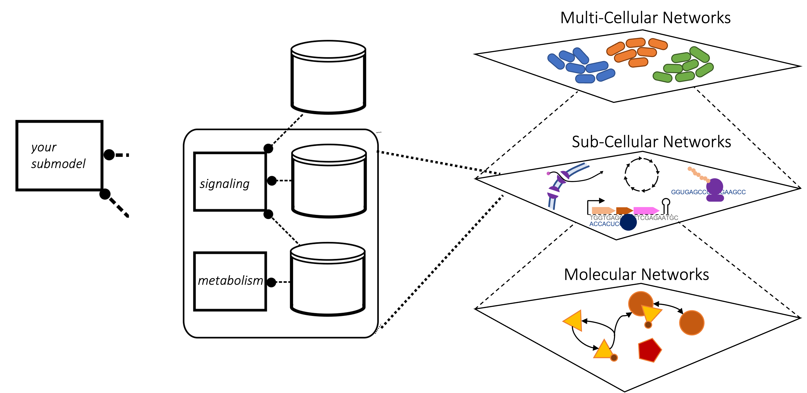

In Comp bio you will a single simulator for a single type of mechanism,
but you very quickly see what you can't do with your simulator.
By embracing modularity you can add new modules, plug them in, and 
run them.
Imagine a multiscale system, where you have simulations within
simulations within simulations. Each of these is uspported by some
computaions processes which you can  then plug in.

## Vivarium offers an intuitive, modular design
The basic elements on Vivarium are:
1. Processes
2. Stores

### Processes
* **Processes**: Consist of parameters, ports, and an update function

#### Minimal Process: Transcription


### Stores
* **Stores**: Hold the state variables, map the variable names to their values,
and apply the updates

### Composites: Combining Modules
* **Composites**: Bundles of processes and stores, wired together by
their ports, and run together in time
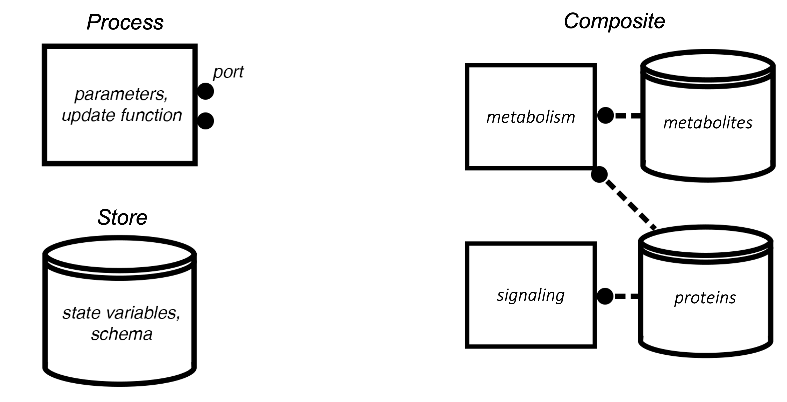

### Minimal Composite: Transcription + Translation
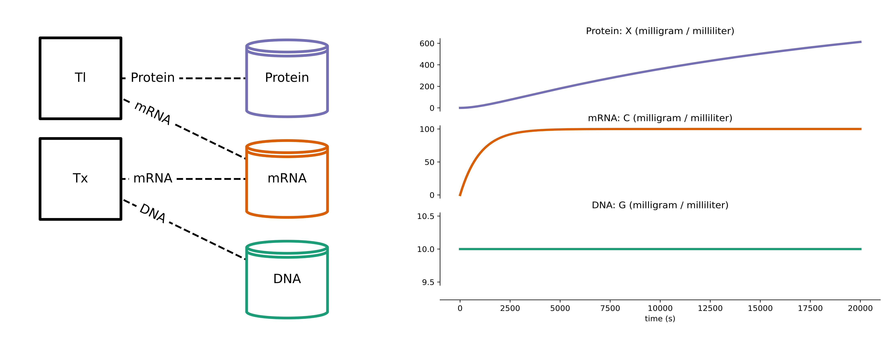

## The Vivarium Engine Supports Multiple Timescales
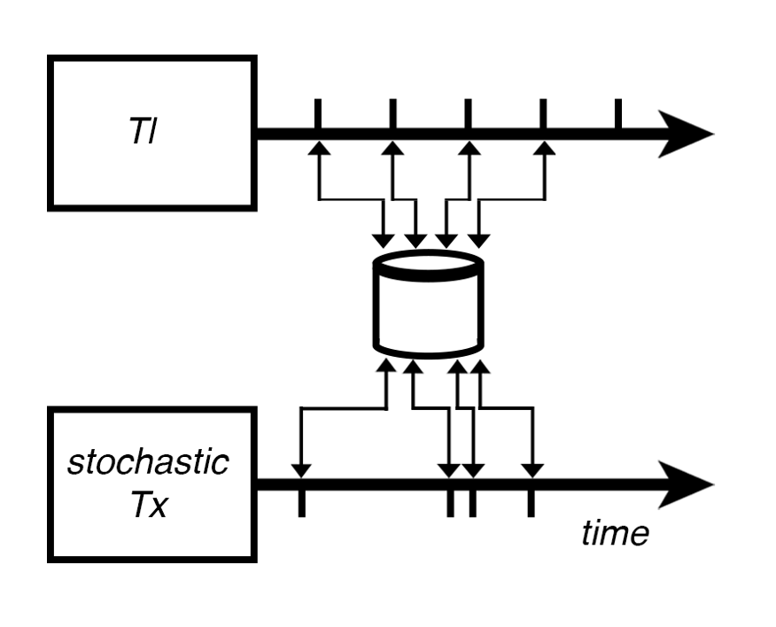

## "Steps" run between time-dependent processes


## Modularity makes it easy to wire in different processes


## Hierarchical embedding enables multiple scales
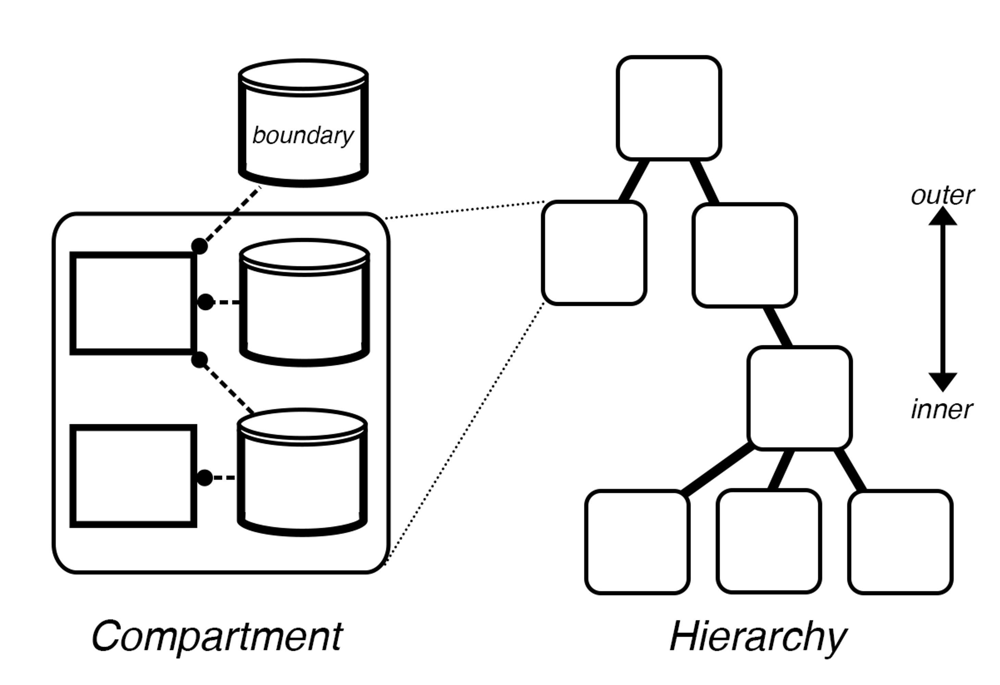


## Hierarchical Updates allow subgraphs to be added/removed/moved during simulation runtime
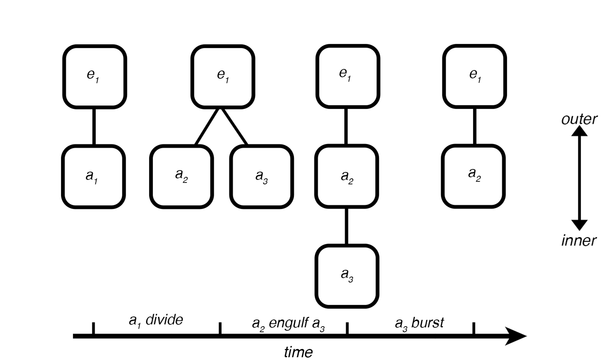

### Hierarchical Update Example: Division


## Tools
### vivarium-cobra: Dynamic Flux Balance Analysis
```bash
pip install vivarium-cobra
```

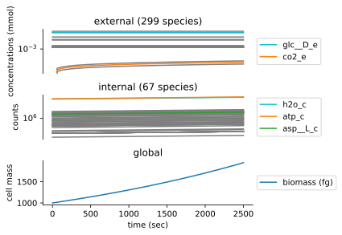

### vivarium-bioscrape: Chemical Reaction Networks
```bash
pip install vivarium-bioscrape
```
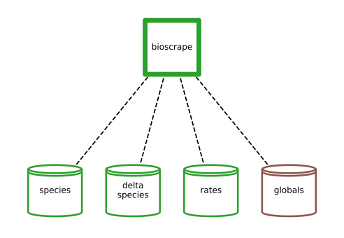


### vivarium-multibody: Solid Body Physics + Diffusion
```bash
pip install vivarium-multibody
```
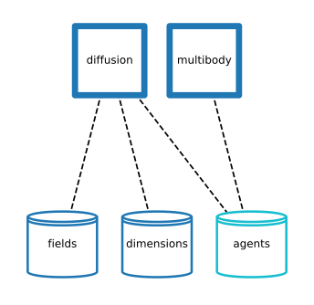
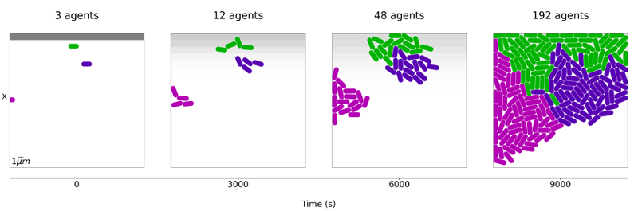

### Wiring it all together


### Simulation results blend properties of all the input simulators
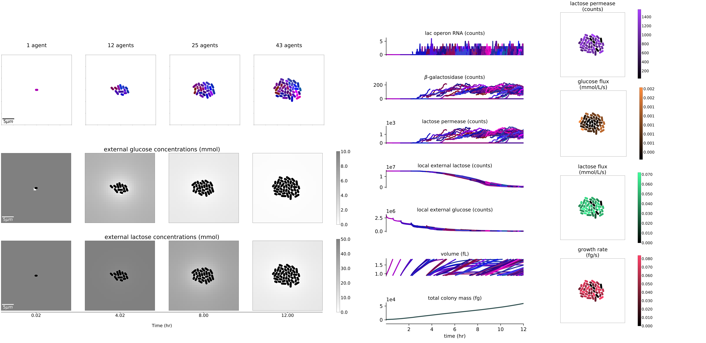

## Biosimulators
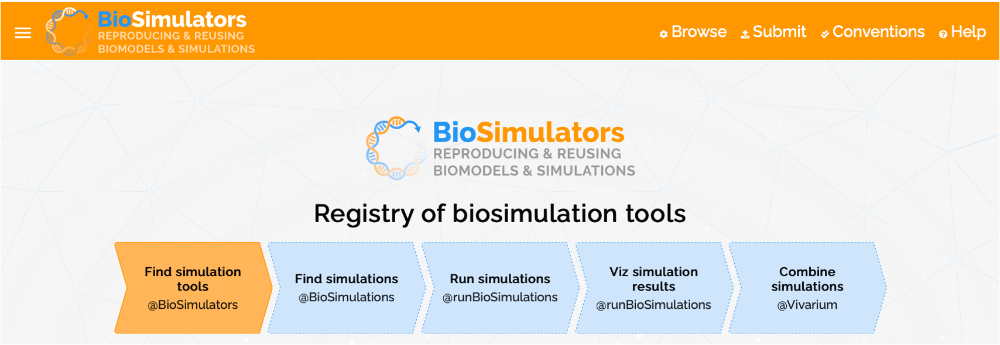

## Vivarium-ecoli
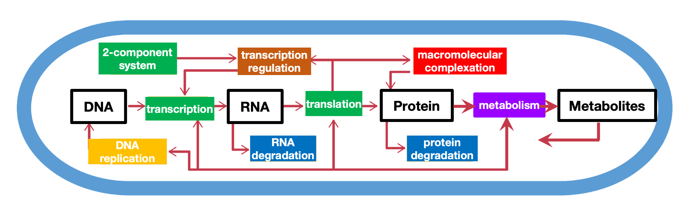

### Mass fractions
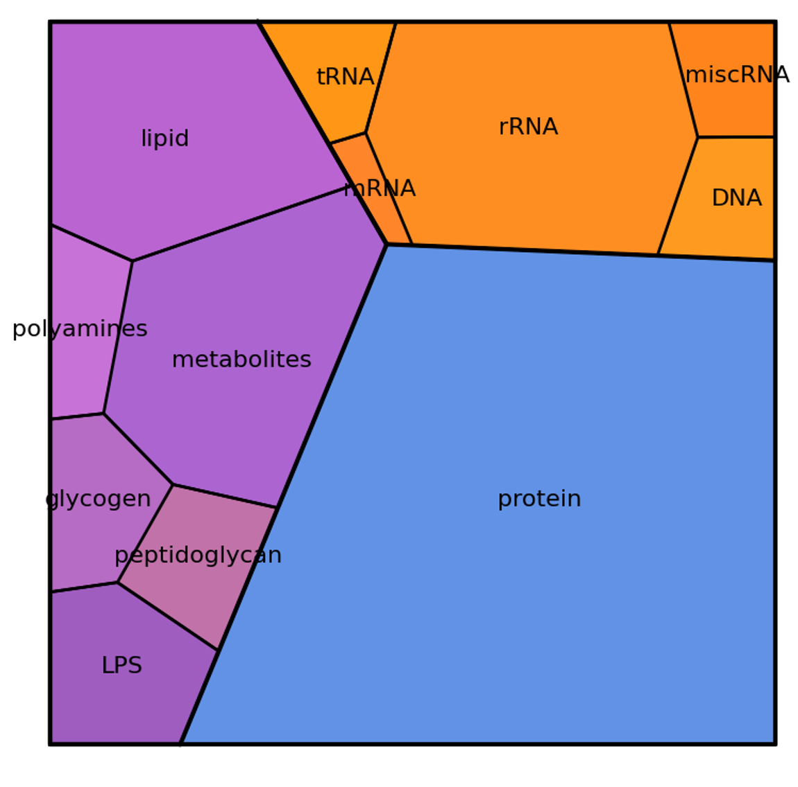

